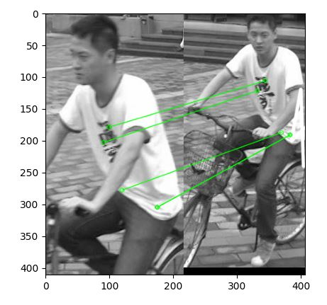
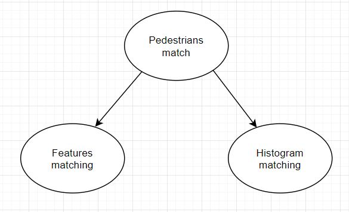

# pedestrian-tracking-system

The project involves the creation of a pedestrian tracking system using probabilistic graphical models. The system is
designed to determine the location of passers-by in successive camera frames by assigning Bounding Boxes to individuals.

## Concept

Idea behind project is to determine set of features for every pedestrian on frame, and every pedestrian on the following
frame. Second step is to try to match this features between frames. Goodness of this matches is then used as input for
Bayes Model to determine probabilities of matching between two pedestrians on two frames.

For every feature there is matching python dict created.

In this project bounding boxes for pedestrian are called ROIs (region of interests)

#### example

there is 2 pedestrian on the first frame, and 2 pedestrians on the following frame, so there is a dict created for every
feature. In this example for histogram matches:

```
    HistogramMatchesDict = {firstRoiId: [histMatchValForFirstROI, histMatchValForSecondROI],
                            secndRoiId: [histMatchValForFirstROI, histMatchValForSecondROI]}
    
    where key is object id for current frame, and value is a list where indexes means ids on next frame
```

## Feature Matching

For finding features on image SIFT feature detector is used. For finding matches between features there is
FlannBasedMatcher. Number of good matches between two pictures is saved, and then is utilzed as an input for Bayes
model.

For feature matching this opencv tutorial was uesed [link](https://docs.opencv.org/3.4/d1/de0/tutorial_py_feature_homography.html).

<p align="center">
  
</p>

## Histogram Comparison
To get more usefull information to match pedestrian there were histogram used. The function cv::compareHist returns 
a numerical parameter that express how well two histograms match with each other. Chosen metric to express 
how well both histograms matches was correlation. Output value is in (0, 1) range.

From pedestrian 
ROI histogram is calculated, and value from histogram comparison serves as input for  Bayes Model.

For histogram comparison this opencv tutorial was used [link](https://docs.opencv.org/3.4/d8/dc8/tutorial_histogram_comparison.html).

## Bayes Model

<p align="center">
  
</p>

Image shows Directed Acyclic Graph for Bayes Model. 
* Node PedestriansMatch is node we query for, and it determines  probability that 2 pedestrian matches together
* Node FeaturesMatching is used as evidence. It can take 4 values witch means:
  * NO_MATCHES_AT_ALL
  * FEW_MATCHES
  * MANY_MATCHES
  * LOT_OF_MATCHES
* Node HistogramMatching is used as evidence. It takes 6 values witch means
  * VERY_BAD_MATCH
  * BAD_MATCH
  * OK_MATCH
  * GOOD_MATCH
  * GREAT_MATCH
  * EXCELLENT_MATCH
  
Conditional Probability Tables for every node were found empirically. 

Data collected from feature matching and histogram comparison is transformed to match conditions 
to serve as evidence values. Then bayes model is queried to get cumulative probability for every pair of pedestrians.
Data from model is collected in dictionary.

The highest probability is found for every pedestrian on current frame. There is simple algorithm to do this cross search
between frames.

There is TrackedROI class that is assigned to one pedestrian for its 'life cicle'.
## Usage

python3 main.py path/to/dataset
